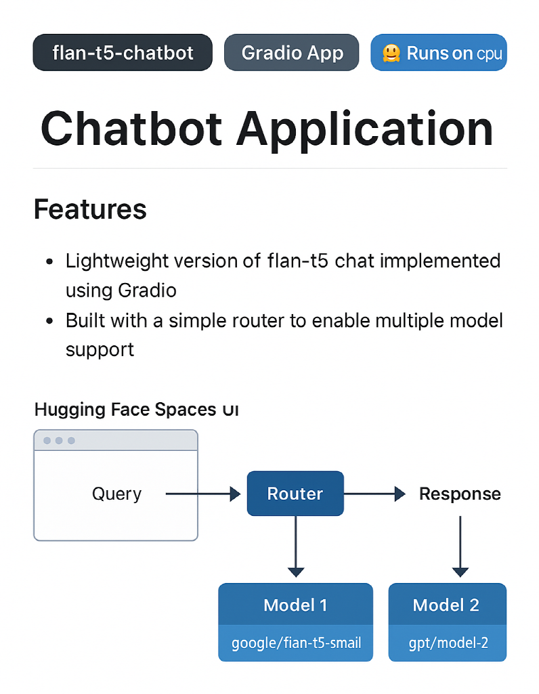
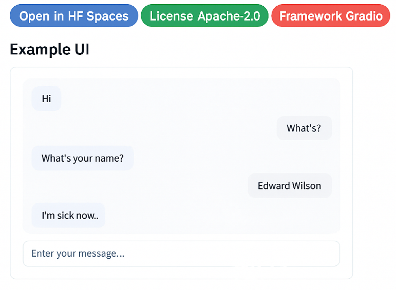

# MCP Auto Router Chatbot (Lightweight Models)

[](https://www.python.org/) 
[](https://huggingface.co/docs/transformers/index)
[](https://gradio.app/)

This project demonstrates an **MCP-style multi-model chatbot** that automatically selects the best model based on the type of user query.

---

## Features
- **Automatic Model Routing**:
  - Simple or short queries → `google/flan-t5-small`
  - Analytical or reasoning queries → `google/flan-t5-base`
- **Lightweight Model Architecture**: Runs on CPU-only environments (Hugging Face Spaces free tier)
- **Conversation History Download** as `.txt`
- **Interactive Web UI** built with Gradio

---

## Architecture


- **Router**: Classifies query type
- **Models**: Uses either `flan-t5-small` or `flan-t5-base`
- **Output**: Returns both the text response and JSON metadata (model, tokens, inference time)

---

## Live Demo  
[**👉 Try it on Hugging Face Spaces**](https://huggingface.co/spaces/eunki-7/mcp-auto-router-chatbot)

---

## Source Code  
[**📂 View on GitHub**](https://github.com/eunki-7/mcp-auto-router-chatbot-portfolio)

---

## How It Works
1. User sends a query via the Gradio interface.
2. The router selects the appropriate model:
   - `flan-t5-small` for quick/simple Q&A
   - `flan-t5-base` for analytical reasoning
3. Response is generated and returned along with metadata.

---

## Tech Stack
- [Gradio](https://gradio.app/) – Web UI
- [Transformers](https://huggingface.co/docs/transformers/index) – Model inference
- Python 3.10+

---

## Installation & Run
```bash
pip install -r requirements.txt
python app.py
```

---

## Example UI


- This is the web-based interface built with Gradio

---

## Use Cases
- Lightweight Q&A and reasoning chatbot
- Proof-of-concept for **MCP-style model routing**
- Experiments without large LLM APIs
- Internal knowledge base Q&A
- Customer support assistant prototype

---

## Notes
- The first response may take a few seconds due to model loading (CPU-only environments).
- Subsequent requests are faster due to caching.

---

## Author
**eunki7**  
- [GitHub Profile](https://github.com/eunki-7)